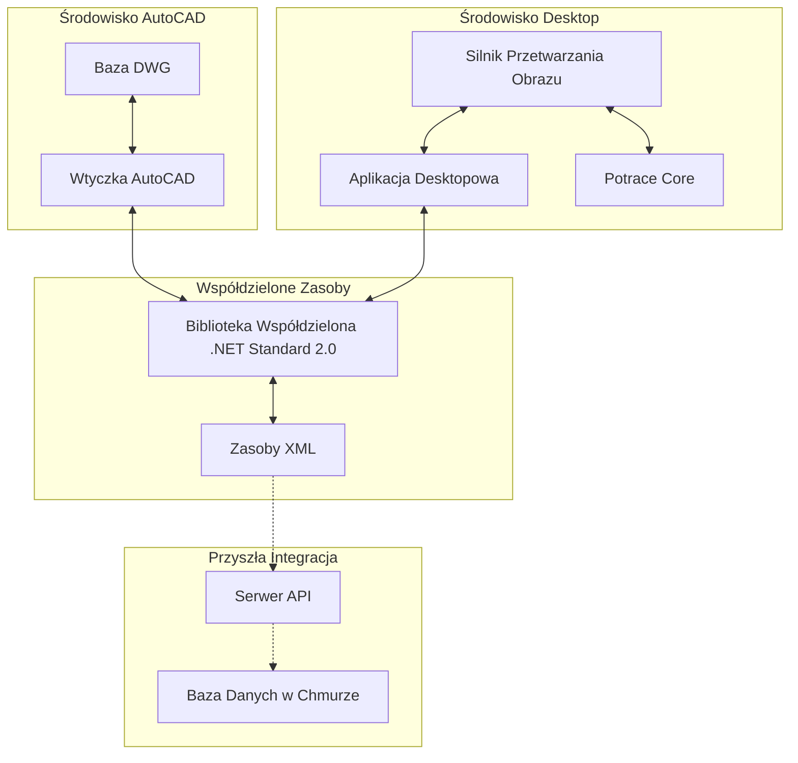
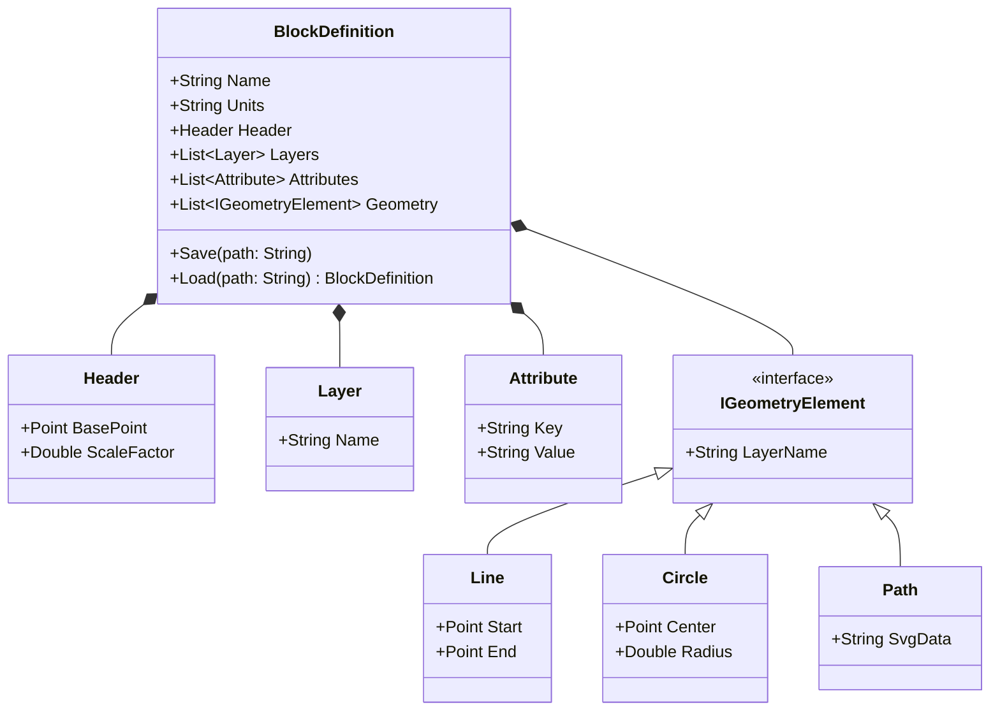
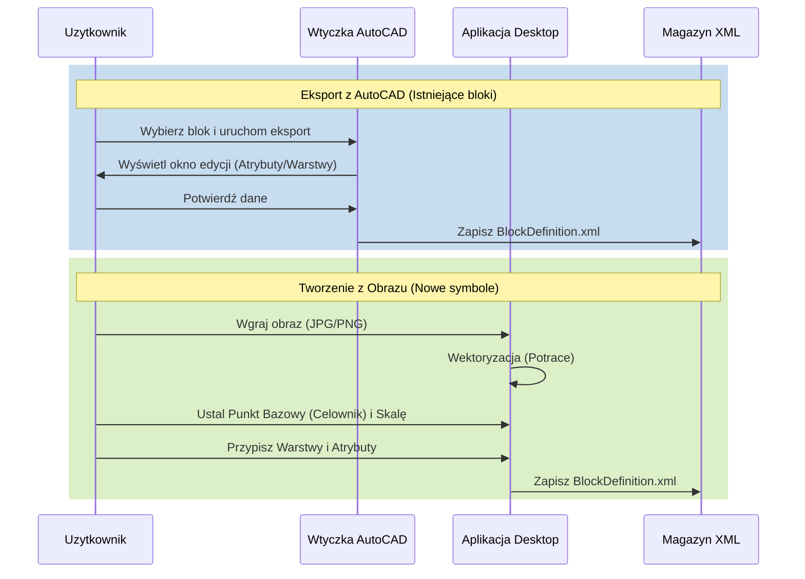

# Universal Block Manager - Roadmap Projektu

## 1. Wizja i Cele
Projekt "Universal Block Manager" ma na celu stworzenie ekosystemu "BIM-lite" dla branży instalacyjnej (elektrycznej), umożliwiającego standaryzację i zarządzanie biblioteką komponentów (bloków) poprzez uniwersalny format XML.

### Główne cele:
*   **Standaryzacja**: Każdy komponent posiada spójną strukturę danych (geometria + atrybuty).
*   **Wielokanałowość**: Możliwość tworzenia zasobów bezpośrednio z AutoCAD lub z grafik rastrowych (np. z katalogów producentów).
*   **Interoperacyjność**: XML jako "paszport" bloku, umożliwiający w przyszłości integrację z bazami danych i serwerami.

---

## 2. Architektura Systemu

System składa się z trzech głównych modułów: wtyczki do AutoCAD, aplikacji desktopowej oraz współdzielonej biblioteki logicznej.



---

## 3. Model Danych (XML Schema)

Sercem systemu jest plik XML opisujący blok. Struktura musi obsługiwać zarówno precyzyjne dane CAD, jak i przybliżone dane wektorowe z obrazów.

### Model Klas (Class Diagram)
Współdzielona biblioteka logiczna będzie zawierać następujące klasy bazowe:



### Przykładowa struktura:
```xml
<BlockDefinition Name="Gniazdko_230V" Units="mm">
  <Header>
    <BasePoint X="10.5" Y="10.5" />
    <ScaleFactor Value="1.0" />
  </Header>
  <Layers>
    <Layer Name="Symbol" />
    <Layer Name="Obrys" />
  </Layers>
  <Attributes>
    <Attribute Key="Producent" Value="Schneider" />
    <Attribute Key="Model" Value="Asfora" />
    <Attribute Key="Napiecie" Value="230V" />
  </Attributes>
  <Geometry>
    <!-- Dane z AutoCAD -->
    <Circle Layer="Symbol" CenterX="0" CenterY="0" Radius="30" />
    <Line Layer="Obrys" StartX="-10" StartY="-10" EndX="10" EndY="10" />
    <!-- Dane z Wektoryzacji (SVG Path) -->
    <Path Layer="Obrys" Data="M 10 10 L 20 20 C 25 25 30 10 10 10 Z" /> 
  </Geometry>
</BlockDefinition>
```

---

## 4. Przepływy Pracy (User Journeys)



---

## 5. Harmonogram Realizacji (Roadmap)

### Faza 1: Fundamenty i Kontrakt XML [ZAKOŃCZONE]
*   **Cel**: Ustalenie wspólnego formatu i stworzenie szkieletu aplikacji.
*   **Zadania**:
    *   [x] Definicja klas C# w `Shared Library` (.NET Standard 2.0).
    *   [x] Implementacja mechanizmu serializacji/deserializacji XML.
    *   [x] Stworzenie MVP aplikacji Desktopowej (WPF + Material Design) do manualnego tworzenia XML.

### Faza 2: Moduł Image-to-SVG (Desktop)
*   **Cel**: Automatyzacja tworzenia geometrii z grafik rastrowych.
*   **Zadania**:
    *   Integracja silnika **Potrace**.
    *   Implementacja interaktywnego Canvasu z obsługą "Celownika" (punkt bazowy).
    *   Narzędzie do skalowania (wybór 2 punktów na podglądzie).
    *   Edytor atrybutów i przypisywanie warstw do ścieżek SVG.

### Faza 3: Wtyczka AutoCAD (Extractor)
*   **Cel**: Wyciąganie precyzyjnych danych z rysunków DWG.
*   **Zadania**:
    *   Konfiguracja Multi-targetingu (AutoCAD 2023-2024 / 2025-2026).
    *   Implementacja okna Modal Dialog w WPF.
    *   Silnik ekstrakcji geometrii (Iteracja po encjach BlockTableRecord).
    *   Obsługa konfliktów nazw (Nadpisz / Zmień nazwę).

### Faza 4: Integracja i Kontrola Jakości
*   **Cel**: Spójność danych i przygotowanie do dystrybucji.
*   **Zadania**:
    *   Implementacja algorytmu upraszczania ścieżek (redukcja liczby punktów SVG).
    *   Testy "Roundtrip": Eksport -> Import (weryfikacja wierności odwzorowania).
    *   Skrypt automatyzujący instalację (.bat + .bundle).
    *   Przygotowanie abstrakcji pod przyszłą integrację z serwerem (IDataStorage).

---

## 6. Stack Techniczny
*   **Język**: C#
*   **UI**: WPF + Material Design for XAML
*   **AutoCAD SDK**: ObjectARX Managed Wrappers
*   **Framework**: .NET 8 (Desktop / AutoCAD 2025+) oraz .NET Framework 4.8 (AutoCAD 2023-24)
*   **Wektoryzacja**: Potrace

---

## 7. Ryzyka i Mitygacja
1.  **Szum w obrazach**: Wektoryzacja zdjęć może dawać słabe wyniki.
    *   *Mitygacja*: Dodanie suwaka "Threshold" oraz upraszczania geometrii w UI.
2.  **Kompatybilność .NET**: Duże różnice między AutoCAD 2024 a 2025.
    *   *Mitygacja*: Użycie projektów typu "Shared Project" lub "Multi-targeting" w CSProj.
3.  **Wielkość plików**: Zbyt złożone ścieżki SVG mogą spowalniać system.
    *   *Mitygacja*: Automatyczne upraszczanie geometrii przy zapisie.
